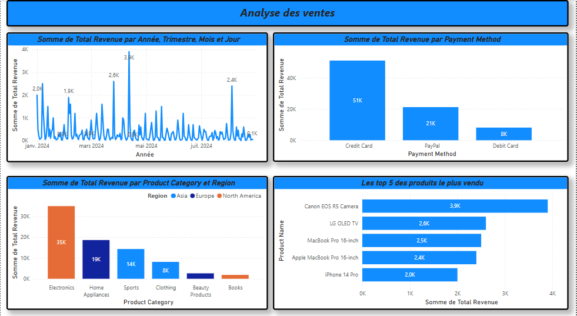

# Tableau de bord Power BI – Analyse des ventes

## Description
Tableau de bord Power BI pour l'analyse des ventes.

## Objectifs
- ,Analyser le chiffre d'affaires par date.
- Analyser le chiffre d'affaires par type de paiement.
- Comparer le chiffre d'affaires selon les catégories de produits 
- Top 5 des produits les plus vendus
  
## Outils utilisés
- Power BI Desktop
- Power Query
- Excel

## Fonctionnalités
- Nettoyage des données
- Modélisation des données
- Tableau de bord

## Aperçu

## Fichier du projet
- ventes.pbix
